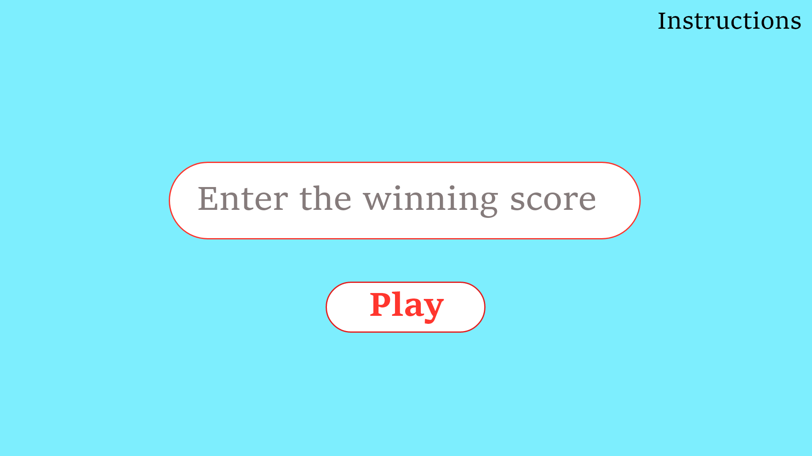
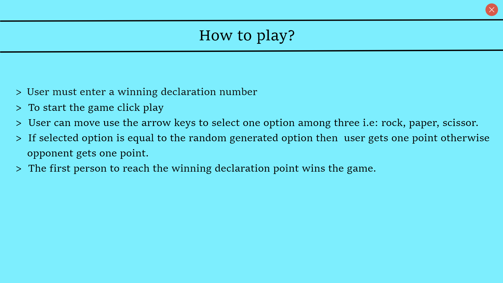
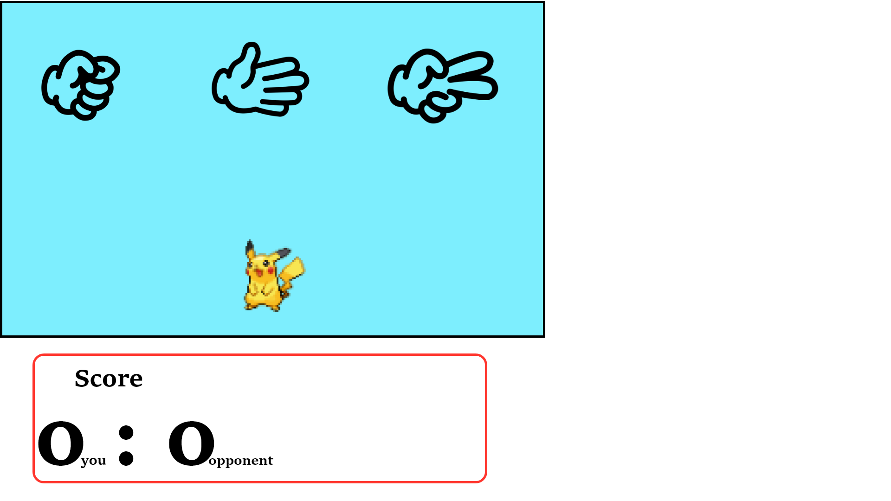
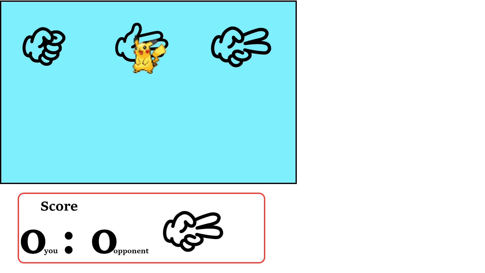

# Application Name
DoTheDew

## Author Name
Gokul and Pratiksha

## Details
This repository consists of a canvas based rock-paper-scissor game. Players can select the target score and start to play. System will randomly generate ramdom images among rock paper scissor and compare it with the selected image if it is a match then player get one point. The first person to reach the target score wins the game. 

## Technology
* HTML
* CSS 
* JavaScript ES6

## Design

## Preview

* link - https://drive.google.com/open?id=13PdeilRnjPQgL33awB4FyPJNYvysFVUZ

